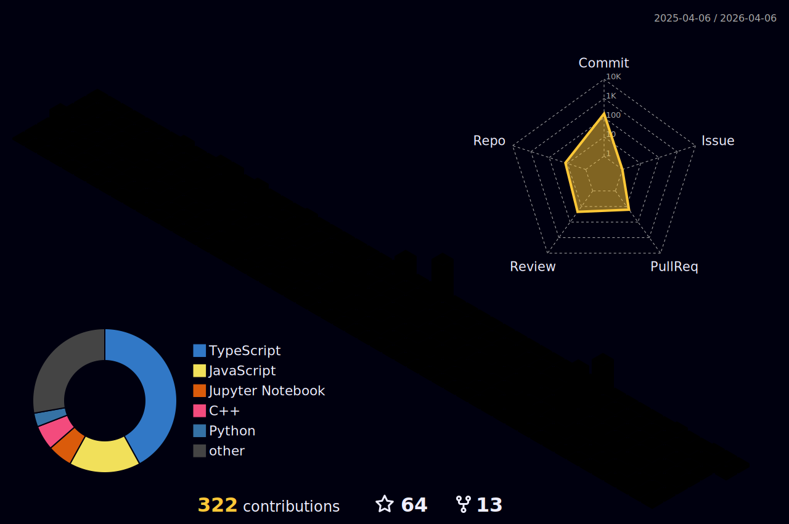

<!-- Header Wave Animation -->

  

<!-- Typing Animation -->

  

<!-- Social Badges -->

  
  
  
  
  

---

<!-- About Me - Portuguese -->

  🤖 Trabalho como Machine Learning Engineer na Google DeepMind. 
  🇧🇷 Sou brasileiro, nortista, casado, pai de dois humaninhos e de dois pitbulls 🐕 
  🤝 Estou sempre em busca de colaborar com projetos que deem retorno social 
  🪴 Atualmente, estudando para tentar diminuir um dos meus maiores gaps de conhecimento: frontend -> então, Angular ftw! 
  💡 Conte comigo para tentar ajudar com questões relacionadas a engenharia de software, ciência de dados, inteligência artificial e consciência de classe.

<!-- About Me - English -->

  🤖 I'm currently working as Machine Learning Engineer at Google DeepMind. 
  🇧🇷 I'm Brazilian, from the north, married, father of two little humans and two pitbulls 🐕 
  🤝 I'm always looking to collaborate with projects with social give back 
  🪴 Currently I'm trying to cover my knowledge gap with frontend -> so Angular ftw! 
  💡 Count on me to try helping with questions about software engineering, data science, artificial intelligence and class consciousness.

---

### Tecnologias e Ferramentas 💻 / Tech Stack 💻

  

---

### 💡 Dev Quote / Citação Dev

  <picture>
    <source media="(prefers-color-scheme: dark)" srcset="https://quotes-github-readme.vercel.app/api?type=horizontal&theme=tokyonight"/>
    <source media="(prefers-color-scheme: light)" srcset="https://quotes-github-readme.vercel.app/api?type=horizontal&theme=default"/>
    
  </picture>

---

### 📕 Últimos Artigos / Latest Blog Posts
<!-- BLOG-POST-LIST:START -->
- [Primeiros passos com o Gemini na Vertex AI](https://medium.com/google-cloud-brasil/primeiros-passos-com-o-gemini-na-vertex-ai-623083cf8780?source=rss-925379214ac4------2)
- [Desenvolvendo com Llama2 na Google Cloud](https://medium.com/google-cloud-brasil/desenvolvendo-com-llama2-na-google-cloud-e5b7b3d0ca14?source=rss-925379214ac4------2)
- [Desenvolvendo soluções com IA Generativa na Google Cloud](https://medium.com/google-cloud-brasil/desenvolvendo-solu%C3%A7%C3%B5es-com-ia-generativa-na-google-cloud-d22d148048a3?source=rss-925379214ac4------2)
- [Criando um modelo de classificação de imagens com AutoML na Vertex AI](https://medium.com/google-cloud-brasil/criando-um-modelo-de-classifica%C3%A7%C3%A3o-de-imagens-com-automl-na-vertex-ai-a19c89c02166?source=rss-925379214ac4------2)
- [Treinando Graph Neural Networks utilizando a Vertex AI](https://medium.com/google-cloud-brasil/treinando-graph-neural-networks-utilizando-a-vertex-ai-3e0884ab4efb?source=rss-925379214ac4------2)
<!-- BLOG-POST-LIST:END -->

  <a href="https://medium.com/@lucianommartins">▶️ mais artigos / more posts...</a>

---

### Minhas Estatísticas do Github 📊 / My Github Stats 📊

<!-- Main Metrics SVG with Achievements -->

  

<!-- 3D Contribution Graph -->

  <picture>
    <source media="(prefers-color-scheme: dark)" srcset="./profile-3d-contrib/profile-night-rainbow.svg"/>
    <source media="(prefers-color-scheme: light)" srcset="./profile-3d-contrib/profile-green-animate.svg"/>
    
  </picture>

  <!-- GitHub Readme Stats -->
  <picture>
    <source media="(prefers-color-scheme: dark)" srcset="https://github-readme-stats.vercel.app/api?username=lucianommartins&show_icons=true&theme=tokyonight&include_all_commits=true&count_private=true&hide_border=true"/>
    <source media="(prefers-color-scheme: light)" srcset="https://github-readme-stats.vercel.app/api?username=lucianommartins&show_icons=true&theme=default&include_all_commits=true&count_private=true&hide_border=true"/>
    
  </picture>
  <picture>
    <source media="(prefers-color-scheme: dark)" srcset="https://streak-stats.demolab.com/?user=lucianommartins&theme=tokyonight&hide_border=true"/>
    <source media="(prefers-color-scheme: light)" srcset="https://streak-stats.demolab.com/?user=lucianommartins&theme=default&hide_border=true"/>
    
  </picture>

---

### 📈 Gráfico de Atividade / Activity Graph

  <picture>
    <source media="(prefers-color-scheme: dark)" srcset="https://github-readme-activity-graph.vercel.app/graph?username=lucianommartins&theme=tokyo-night&hide_border=true&area=true"/>
    <source media="(prefers-color-scheme: light)" srcset="https://github-readme-activity-graph.vercel.app/graph?username=lucianommartins&theme=minimal&hide_border=true&area=true"/>
    
  </picture>

---

<!-- Snake Animation -->

  <picture>
    <source media="(prefers-color-scheme: dark)" srcset="https://raw.githubusercontent.com/lucianommartins/lucianommartins/output/github-contribution-grid-snake-dark.svg"/>
    <source media="(prefers-color-scheme: light)" srcset="https://raw.githubusercontent.com/lucianommartins/lucianommartins/output/github-contribution-grid-snake.svg"/>
    
  </picture>

---

### 💡 Meu Perfil no Stack Overflow / My Stack Overflow Profile

  <a href="https://stackoverflow.com/users/18227814/luciano-martins">
    <picture>
      <source media="(prefers-color-scheme: dark)" srcset="https://github-readme-stackoverflow.vercel.app/?userID=18227814&theme=dark"/>
      <source media="(prefers-color-scheme: light)" srcset="https://github-readme-stackoverflow.vercel.app/?userID=18227814&theme=light"/>
      
    </picture>
  </a>

---

### ✨ Minha Atividade Recente / My Recent Activity
<!-- GITHUB_ACTIVITY:START -->- 17/01/2026: lucianommartins pushed devpulse - 16/01/2026: lucianommartins created a branch - 06/01/2026: lucianommartins pushed roseyTheVoice - 05/01/2026: lucianommartins pushed roseyTheVoice - 05/01/2026: lucianommartins pushed roseyTheVoice - 05/01/2026: lucianommartins pushed roseyTheVoice - 05/01/2026: lucianommartins pushed roseyTheVoice - 04/01/2026: lucianommartins created a branch - 03/01/2026: lucianommartins starred lucianommartins/SimplifAI - 02/12/2024: lucianommartins made this repository public <!-- GITHUB_ACTIVITY:END -->

---

  

